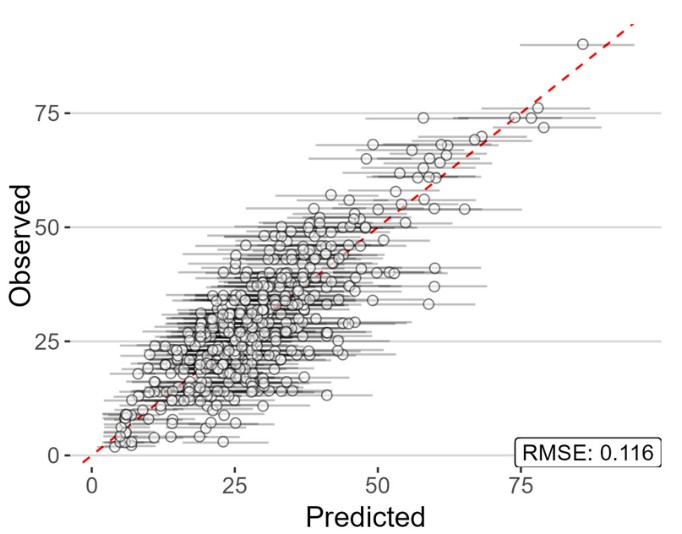
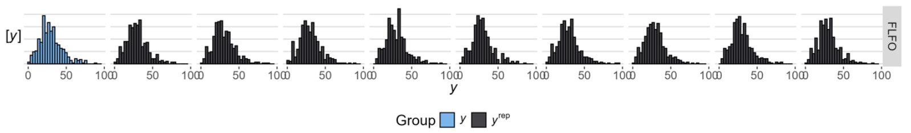
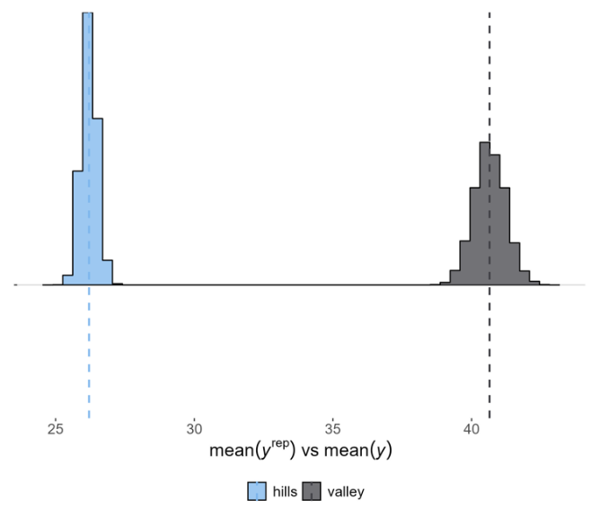
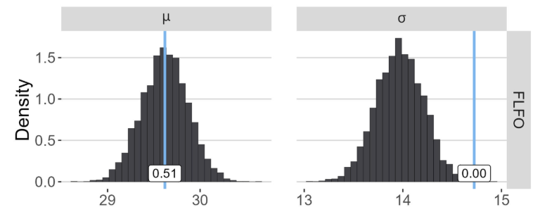
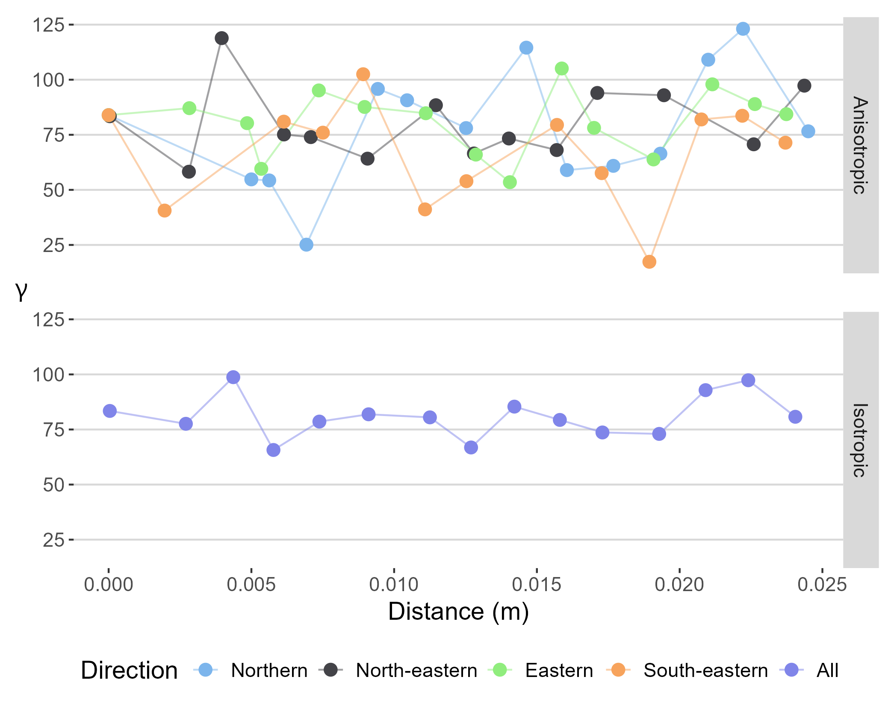

# 02-checking | model checking

## Overview

A suite of graphical and tabular displays for model checking.

| __File__ | __Description__ |
|:---|:---|
| op/ | Observed vs. predicted plots |
| ppc/ | Graphical displays comparing the observed data to data simulated from the posterior predictive distribution. For mixed models, there will be files for each of the distributions. If the model fits well, we should be able to use it to generate data that looks a lot like the data we have in-hand. Subfolders for outputs by stratum and unit or other grouping variables specified by `ppc facets` in the analysis config file (see HERE for more). |
| variography/ | Checks for spatial autocorrelation  |
| effective-sample-size.txt | ADD DESCRIPTION |
| residuals-vec.rds | An object with the residual values, i.e., the differences between the observed and predicted data |

## Subdirectories

### op/ | observed vs. predicted plots

| __File__ | __Description__ |
|:---|:---|
| op-y-rep.jpg | A scatterplot of observed (y-axis) vs. the median predicted (x) values. The horizontal lines / whiskers around each point correspond to the 95% HDI for the y^{rep}'s associated with each observation. Ideally there’s a nice clustering of points along a diagonal line. If points are clustered below the line, the model is overpredicting observed values (positive bias). If they are clustered above the line, the model is predicting values lower than observed values (negative bias). |

#### Examples
This example of op-y-rep.jpg shows a clustering of points along a diagonal line. The closer RMSE (root mean square error) is to 0, the more accurate the model. Fan shapes indicate the model struggles predicting larger or smaller magnitudes. Curvature suggests a non-linear feature is needed to fit the observed data.

### ppc/ | posterior predictive checks
Graphical displays comparing the observed data to data simulated from the posterior predictive distribution. For mixed models, there will be files for each of the distributions. If the model fits well, we should be able to use it to generate data that looks a lot like the data we have in-hand.
Subfolders for outputs by stratum and unit and any other faceting variables specified by `ppc facets`, as described [here]().
| __File__ | __Description__ |
|:---|:---|
| y-rep-bayes-p-by-stratum_id[unit_code].csv |  Bayesian p values for mu and sigma by stratum or unit code|
| y-rep-by-stratum_id[unit_code]-9-draws.jpg | Separate histograms of y and some (n=9) of the y^{rep} datasets |
| y-rep-by-stratum_id[unit_code]-stats.jpg | The distribution of test statistics. The solid, vertical line is the value of the test statistic computed from the observed data, y, while the underlying bars represents the distribution of the test statistic in the y^{rep} simulations. |

#### Examples
The examples below show a mix of stratum-level and park-level model checking. 

In this figure, the blue plots show the actual data (y) and the gray plots show the model-derived replicate data (y^{rep}). Look to see whether the shape of the replicate data matches those of the actual data and the chosen distribution. 

This figure is a variation of the previous figure where you can see how well the replicate data matches the actual data. In both strata, the simulated data appears to have lower variance than the actual data (which will also be revealed in the last figure in this section). 

The vertical line showing the value of the test statistic is in the middle of the distribution for both the hill stratum (left) and valley stratum (right). This suggests the model is accurately estimating the mean.

In this example, the test statistic for mean is very close to 0.5 indicating the model’s simulated data is accurately capturing the mean. However, the test statistic for the variance is 0. This means the model is likely overfitted and lacking the variability present in the observed data, indicating a different likelihood may be needed.

### variography/ | spatial autocorrelation
 
| __File__ | __Description__ |
|:---|:---|
| residuals-df.rds | Residuals for each observation. Used as input to variograms. |
| variograms.png | Figure shows degree of spatial autocorrelation in data, semi-variance by distance by direction or by any direction. Note that the default is to evaluate up to 1/3 of the total distance represented in the data. |

#### Examples
The variogram shows the degree of spatial autocorrelation; a high degree of spatial autocorrelation would warrant an adjustment to the model. The top figure has a line for each direction and the bottom figure represents all directions. The y-axis is the semivariance, where higher values indicate data points that are less alike. The x-axis represents the physical distance between pairs of data points.  If you see a distinct trend or threshold change, such as points clustered at one end and more spread out at the other, there may be problematic spatial autocorrelation. 
