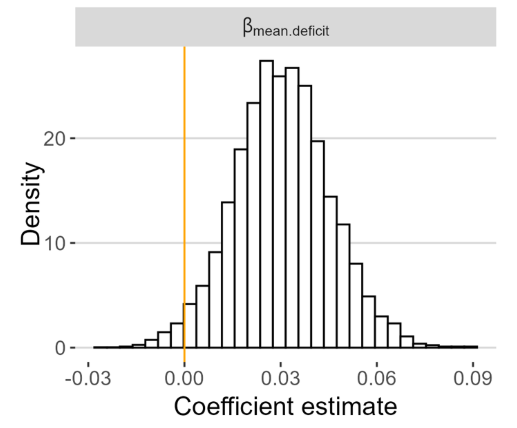
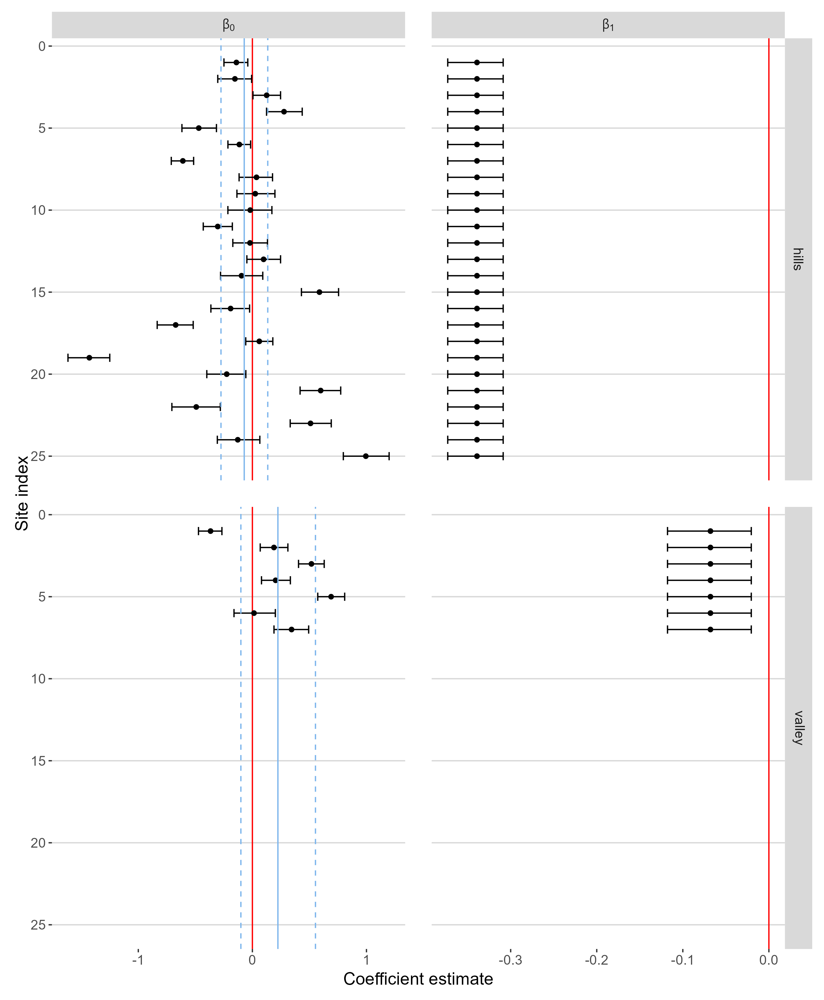
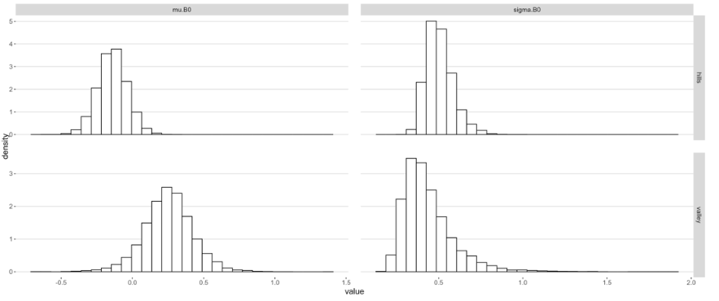
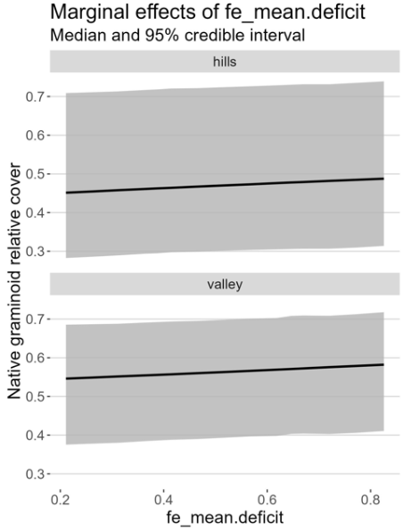
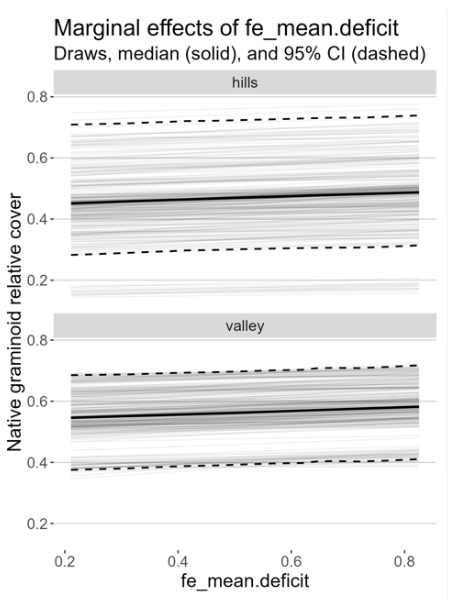
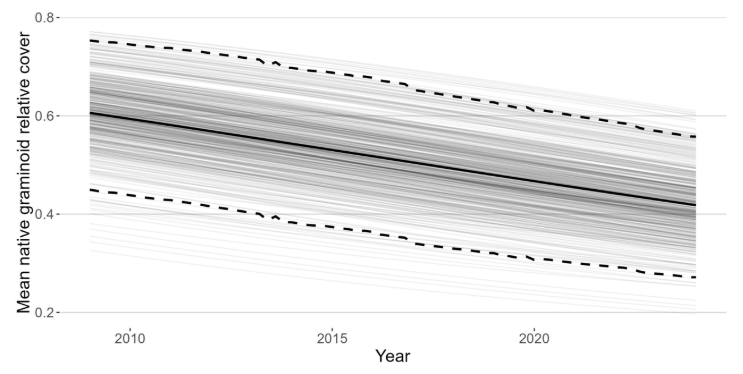
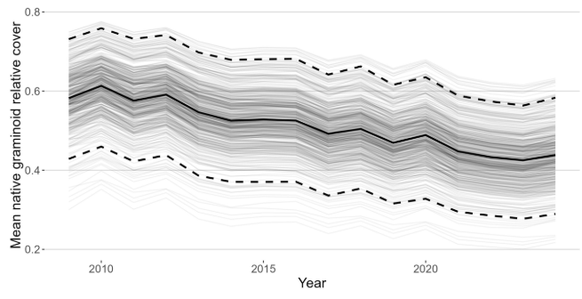
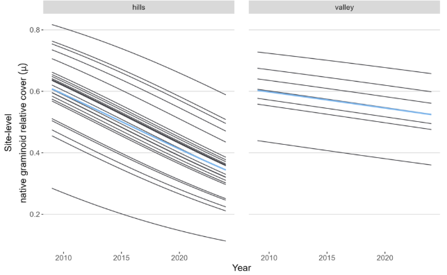
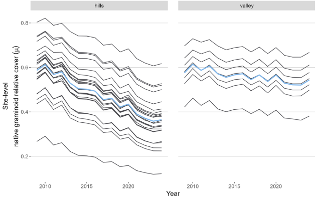
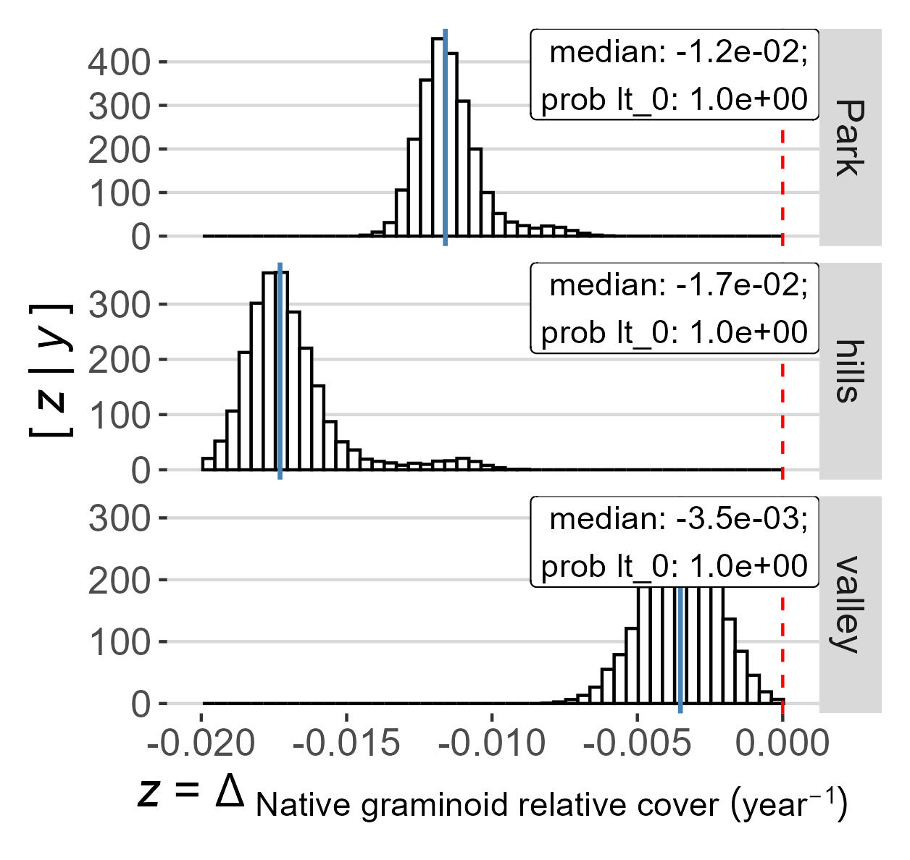

# 03-inference | model inference

## Overview

Tabular and graphical summaries of Markov chain Monte Carlo (MCMC) draws from the posterior distribution of the parameters of a Bayesian model. The asterisk corresponds to the coefficients. 
If the configuration file specifies `time effect: disabled`, only the `coef` (coefficient) folder is produced.
If the configuration file specifies `drivers: true`, an additional `me` (marginal effects) folder is produced.
If the pipeline specifies `save_forecast_inputs`, an additional `04-forecast` folder is produced. See [Fitting for Forecasting]() for details.

| __File__ | __Description__ |
|:---|:---|
| coef/ | Model coefficients |
| me/ | Marginal effects |
| park/ | Park-level inference |
| site/ | Site-level inference |
| strata/ | Stratum-level inference |
| trend/ | Trend inference
| zone/ | Zone-level inference (optional) |
| coda-samples-quantiles.csv | Quantiles of the posterior distribution of key variables / parameters  |
| coda-samples-summary.txt | Descriptive statistics and quantiles of the posterior distribution of key variables / parameters |

## Subdirectories

### coef/ | model coefficients

| __File__ | __Description__ |
|:---|:---|
| additional-coef-estimates-Beta-untransformed.png | The posterior distribution of fixed effect (covariate) terms.  |
| beta-coef-estimates-untransformed.png | The median (points) and 95% equal-tailed credible intervals for group-level (random) effects. When the model is `b0` only the intercepts (\beta_{0j}) will vary by site within each stratum. When the model is `b0-b1` both intercept (\beta_{0j}) and time-slope terms (\beta_{1j}) will vary by site (with correlation \rho).  |
| hypers-hist-*.png | The hyper-distribution of random intercepts ("hypers-hist-B0.png") or random time-slope terms ("hypers-hist-B1.png") for each stratum  |

#### Examples
In the example below, the posterior distribution of the fixed effect (coefficient) is mostly above 0, indicating a positive relationship between the coefficient (mean.deficit) and the response (native graminoid cover). This figure will only appear in the output if you include a covariate in the model.

The example below shows the median (point) and 95% credible intervals (whiskers) for random effects. You can see how the estimate for the intercept (\beta_{0}) varies by each site within each strata (hills and valley), where some are positive and some are negative. This particular model did not allow the time-slope terms (\beta_{1}) to vary by site, so the coefficients for slope are fixed for each site in a stratum. If the model were `b0-b1` (varying intercept and slopes), you would also see the variation of the time-slope term by site.

The mean (\mu) and variance (\sigma) of the hyper-distribution of random intercepts term for each strata.

### me/ | marginal effects
Marginal effects folder includes any marginal effects specified in the config file.

| __File__ | __Description__ |
|:---|:---|
|me-fe_mean.deficit-band.jpg | A plot showing the marginal fixed effects, or the change in the response in relation to the covariate, while holding time constant. | 
|me-fe_mean.deficit-spaghetti.jpg | A variation of the plot above with different aesthetics. | 
|me-X.rds| The data required to reproduce the plot. | 

#### Examples
This example shows the relationship between the covariate (mean.deficit) and the response (native graminoid relative cover), while holding time constant. There appears to be a slightly positive slope. Refer to the coef output (additional-coef-estimates-Beta-untransformed.png) to see how the posterior distribution relates to 0 to determine whether there is a significant trend.

The spaghetti plot shows the same information as the previous plot, just with lines for the posterior draws (darker shading indicates a higher concentration of lines) and dashed lines showing the 95% credible intervals.

### park/ | park-level inference
Park-level mean of the response over time. Subfolders include results for all possible sites ("all") and sampled sites ("sampled"). Unless you have provided covariates for all sites, inference with covariates (the `pred` files) will be limited to sampled sites.

In the file names below, the first asterisk corresponds to either `hat` or `pred`. The `hat` files hold any covariates present at their mean (essentially removing -- or controlling for -- the effect of changes in the covariates over time). The `pred` files (_if_ present) correspond to predictions of park-level means conditional on the actual time-varying values of covariates -- AKA "bumpy plots." The uncertainty intervals, sometimes called "credible intervals", are derived using the 95% [Highest (Posterior) Density Intervals](https://cran.r-project.org/web/packages/HDInterval/index.html), by default (dotted black lines). The median is shown in the solid black line. If "out of sample" (`oos`) JAGS objects, exist, results are provided both for the expected value (i.e., for the mean) of new observations as well as the value of new observations themselves .

| __File__ | __Description__ |
|:---|:---|
| *-park-mean-annual-summary-hdi95.csv | Annual estimates of status (median, lower and upper credible intervals).  |
| *-park-mean-plot-hdi95.jpg | Graphical representations of the RDS file. In the figures, the semi-transparent thin lines are draws from the posterior distribution of the park-level mean; the thick, solid dark line is the median of the mean and the thick, dashed lines correspond to the 95% HDIs at each timestep. |
| *-park-mean-plot-objects-hdi95.rds| The data required to reproduce the plot. |

Depending on the analysis, several other files may appear, including: `\*-site-means-(\<stratum-id\>).png`, and `pred-site-means-df.csv`. 

#### Examples
In the “hat” plot, the covariate is held at its mean, producing a smooth trend line of mean native graminoid relative cover over time. 

In the “pred” plot, the covariate is time-varying, showing the influence over changing levels of water deficit during the sampling period. Notice there still appears to be an overall declining trend.

### site/ | site-level inference
Site-level mean of the response over time. Subfolders for all possible sites (“all”) and sampled sites (“sampled”). Unless you have provided covariates for all sites, inference with covariates (the ‘pred’ files) will be limited to sampled sites. 

In the file names below, the first asterisk corresponds to either 'hat' or 'pred', as described under Park-level inference. 

| __File__ | __Description__ | 
|:---|:---| 
| *-site-in-stratum-means.csv | Annual estimates of status of the response (mean, standard deviation, lower and upper credible intervals) for each site-in-stratum.  Especially useful in creating custom plots.| 
| *-site-in-stratum-means.png | Graphical representations of the RDS file showing the site-level mean (black lines) and the median of site-level means (blue line) for each stratum over time. |  
| *-site-in-stratum-means.rds| The data required to reproduce the plot.| 
| *-site-means-(stratumX).png | Estimates of site-level means for each sampled site. The black line represents the mean, the blue band 95% credible intervals, and the dots values for each sampling event. There should be a separate file for each stratum. | 

#### Examples
These plots show the site-level means (black lines) for each site in the hills stratum (left) and valley stratum (right), while holding the covariate at its mean. The blue line is the median of the site-level means. There appears to be a larger decline in native graminoid cover in the hill sites than the valley sites. The spacing between the lines reflects the variation among sites. (The intercept, but not the slope, was permitted to vary among sites in this model.) 

These plots show the site-level means individually, with observed data overlaid (dots). This model allowed the intercept, but not the slope, to vary among sites. 
.png)

These plots allow the covariate to vary over time, as illustrated in the variation in the response over time, reflecting changes in water deficit year-to-year.

### strata/ | stratum-level inference
Strata-level mean of the response over time. Subfolders for all possible sites (“all”) and sampled sites (“sampled”). Unless you have provided covariates for all sites, inference with covariates (the ‘pred’ files) will be limited to sampled sites. 

In the file names below, the first asterisk corresponds to either 'hat' or 'pred', as described under Park-level inference. 

| __File__ | __Description__ | 
|:---|:---|
| *-stratum-means-contrasts.png | Plot showing the difference in stratum-level response over time.| 
| *-stratum-means-contrasts.rds | The data required to reproduce the contrast plot.| 
| *-stratum-means.csv | Annual estimates of status of the response (mean, standard deviation, lower and upper credible intervals) for each stratum.  Especially useful in creating custom plots.| 
| *-stratum-means.png | Graphical representations of the RDS file showing the stratum-level mean over time. In the figures, the semi-transparent thin lines are draws from the posterior distribution of the stratum-level mean; the thick, solid dark line is the median of the mean and the thick, dashed lines correspond to the 95% HDIs at each timestep.| 
| *-stratum-means.rds | The data required to reproduce the stratum-means plot. | 
| *-stratum-means-no-cis.png | A variation of the stratum-means plot with no dashed lines showing the credible intervals. | 
| *-stratum-means-with-data.png | A variation of the stratum-means plot showing gray points representing actual data, thick dashed lines for the credible intervals, and thin dashed lines representing the credible intervals for a new, unsampled site (which are usually wider). | 
| *-stratum-means-with-data-no-cis.png | A variation of the stratum-means plot showing actual data and no credible interval. 
| *-stratum-new-obs.png | A variation of the stratum-means plot showing both the credible intervals for sampled sites (thick dashed lines) and for a new, unsampled observation (thin dashed lines).

### trend/ | trend
Trend estimates of the response. Subfolders for all possible sites (“all”) and sampled sites (“sampled”).

| __File__ | __Description__ | 
|:---|:---|
|---|---| 
| trend-park-avg-annual-change-plot.jpg | Plot showing the estimates of the median trend at the park and strata level. The x-axis is the change in the response per year. Prob It_0 is the probability that the median is < 0. | 
| trend-park-avg-annual-change-posteriors.csv |Posterior draws of the average change per year with the  quantile value. | 
| trend-park-avg-annual-change-quantiles.csv | Mean change per year at the park and strata level. | 

#### Examples
This plot suggests a negative trend in average annual native graminoid relative cover. It is most negative in the hills stratum.

### zone/ | zone
Zone-level mean of the response over time if deflections / sum-to-zero effects are specified for a categorical covariate (e.g., `MgmtZone (deflections)`). In the file names below, the first asterisk corresponds to either 'hat' or 'pred', as described under Park-level inference. 
See [Management Zones]() for more information.

| __File__ | __Description__ |
|:---|:---|
| *-jags-zone-means.rds | The data required to reproduce the plot.|
| *-zone-means.csv | Annual estimates of status of the response (mean, lower and upper credible intervals) for each zone.  Especially useful in creating custom plots. |
| *-zone-means.png| Graphical representation of the RDS file showing the zone-level mean over time (black line) and the 95% credible interval (blue envelope). |

## References


