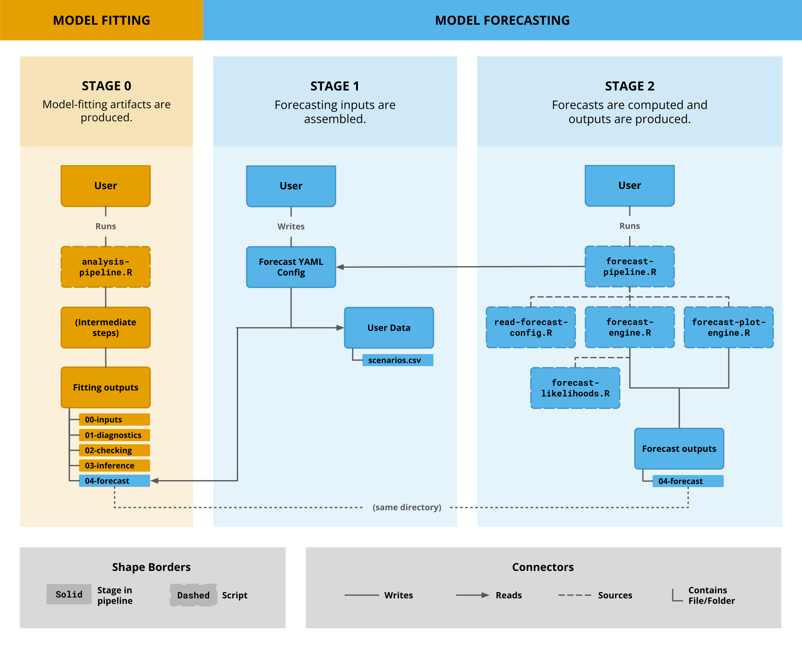
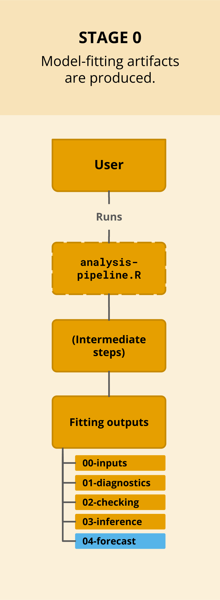
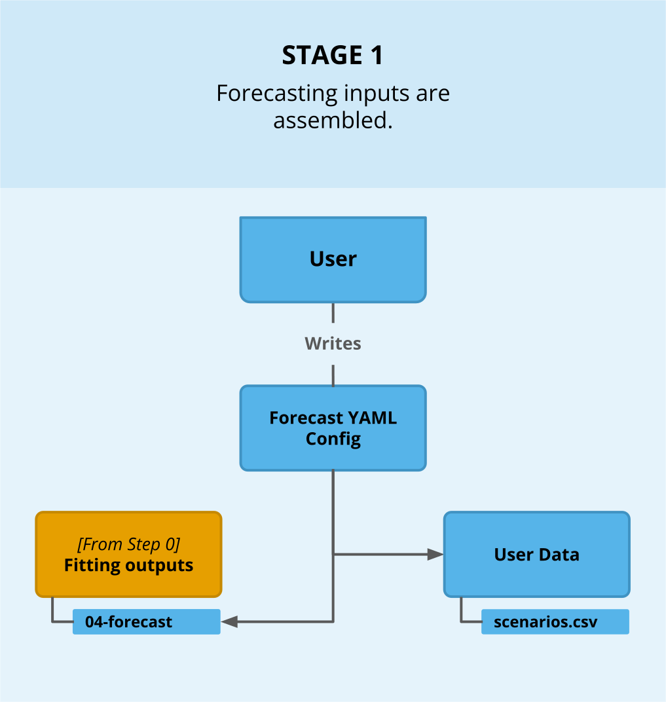
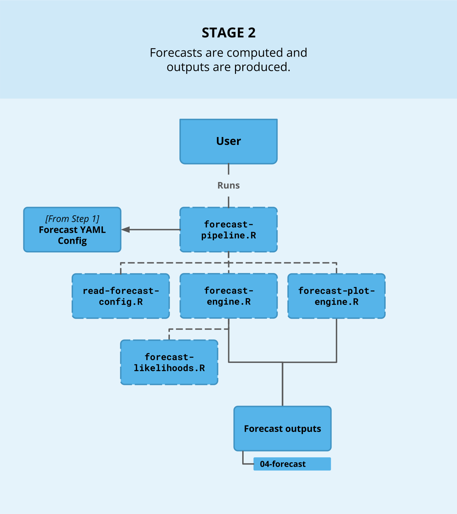

# Pipeline Architecture

This page is a big-picture view of how the forecasting code fits together. For example, it talks about the scripts that make up the pipeline and how data flows between them.

**On this page:**

1. [The forecasting pipeline at a glance](#the-forecasting-pipeline-at-a-glance) — architecture diagram
2. [Stage 0: model-fitting artifacts](#stage-0-model-fitting-artifacts) — preliminary model fitting outputs
3. [Stage 1: forecasting inputs](#stage-1-forecasting-inputs) — forecasting inputs
4. [Stage 2: the forecast pipeline](#stage-2-the-forecast-pipeline) — scripts that run a forecast
5. [Script reference](#script-reference) — forecasting scripts summarized

---

## The forecasting pipeline at a glance

The diagram above lays out the full forecasting pipeline. It is split into two sections: model fitting on the left and model forecasting on the right. The two sections are decoupled, meaning they are connected only via the `04-forecast` directory, which model fitting *writes to* and forecasting *reads from* (and later writes to).

**How to read the diagram:**

The pipeline runs in three stages, left to right (Stage 0 → Stage 1 → Stage 2). Each stage reads top to bottom, starting from the `User` box. The following table repeats the legend/key at the bottom of the diagram:

| Symbol | Meaning |
|---|---|
| **Box with solid border** | A stage artifact (such as a file or folder) |
| **Box with dashed border** | A script (a `.R` file) |
| **Plain line** | The source box *writes* to the target box |
| **Arrow** | The source box *reads* the target box |
| **Dashed line** | The source script *sources* another script via `source()` |
| **Bracket/Elbow line** | The source box *contains* the file/folder beneath it |

> "Sources" refers to R's `source()`, which loads another script's functions into the current session.

The next three sections walk through each stage.

---

## Stage 0: model-fitting artifacts

Model fitting must happen before forecasting. Since this page focuses on forecasting, this stage is intentionally brief (for more on the fitting workflow, see [fitting a model for forecasting]().)

A model fitting run writes several output folders (`00-inputs`, `01-diagnostics`, `02-checking`, `03-inference`, and `04-forecast`). The last one, `04-forecast`, is the handoff point into the forecasting pipeline. It holds the fitted model's posterior draws (`mcmc-draws-full.csv`), its metadata (`forecasting-metadata.rds`), the training-data covariate moments (`covariate-moments.rds`), and the site/stratum lookup tables.

Stage 1's config will point to this `04-forecast` folder.

---

## Stage 1: forecasting inputs

Forecasting accepts a user configuration YAML, which points to two boxes: 1) the artifacts from Stage 0's `04-forecast` folder, and 2) the future scenario covariate data (named `scenarios.csv` in the diagram). The YAML also includes settings that determine forecast behavior, such as which scenarios to run and how covariates are handled.

The [config files]() page details how to write a forecast config YAML, and the [scenarios data]() guide explains how to format a future scenario covariate CSV.

---

## Stage 2: the forecast pipeline

A forecast is run via `forecast-pipeline.R`. It reads the forecast config YAML (which points to the Stage 0 artifacts and covariate data), then sources a collection of scripts. The scripts are detailed in the following [Script reference](#script-reference) section.

The engine and plot modules write their results back into the `04-forecast` folder. The outputs are organized under `04-forecast/runs/` for ensemble summaries across model runs, cross-scenario comparison plots, etc, and `04-forecast/diagnostics/` a set of overall diagnostics. The [Outputs]() guide described this output layout its content.

The steps of `forecast-pipeline.R` are covered in more detail in the [Pipeline Walkthrough]().

---

## Script reference

All of the forecasting scripts live in the `forecasting/forecast/` directory of the repository. Below is the role and relation of each one.

| Script | Role | `source()` relationships |
|---|---|---|
| **`forecast-pipeline.R`** | Initiates + orchestrates the pipeline. Reads the YAML config and Stage 0 artifacts, then drives the modules. | Sources `read-forecast-config.R`, `forecast-engine.R`, and `forecast-plot-engine.R`. |
| **`read-forecast-config.R`** | Reads and validates the forecast config YAML (schema checks, file-existence checks). | Sourced by `forecast-pipeline.R`. |
| **`forecast-engine.R`** | Performs the posterior-predictive computation. | Sources `forecast-likelihoods.R`; sourced by the pipeline. |
| **`forecast-likelihoods.R`** | Likelihood-agnostic predictive samplers and inverse-link functions for each likelihood family. | Sourced by `forecast-engine.R`. |
| **`forecast-plot-engine.R`** | Plots and visualizes the forecast results. | Sourced by `forecast-pipeline.R`. |
