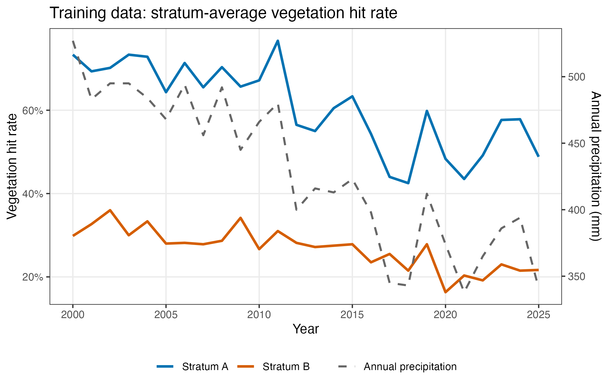
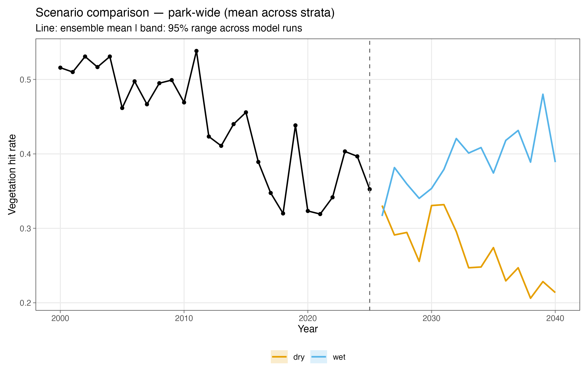
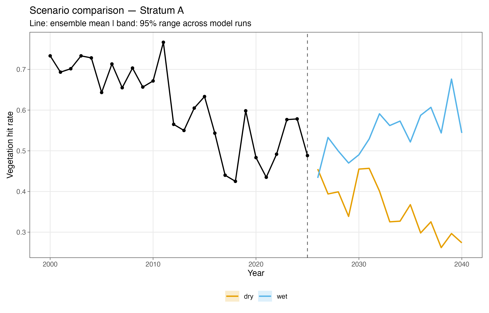
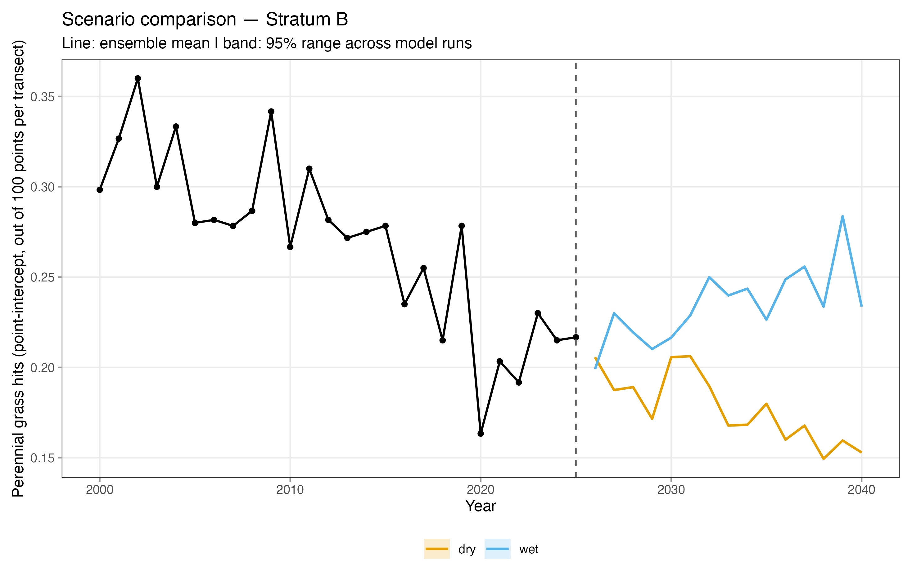
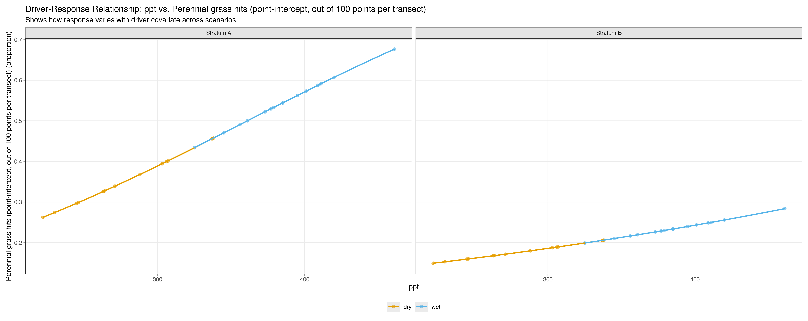

# Your First Forecast (Mock Data)

This tutorial walks through a simple forecast run using synthetic data. You'll fit a vegetation cover model, generate forecasts under two climate scenarios, and interpret how the model's learned patterns manifest in these forecasts.

## Prerequisites

See the [getting started]() section if you haven't used the model fitting pipeline before. The model fitting steps (Steps 1 and 2) are pretty brief, so if you're unfamiliar with the model fitting process, the linked guides in each section are a good place to start.

## Step 0: Understand the mock data

This mock dataset represents a park unit (ELDO) with two vegetation strata (A and B), six sites per stratum, and one transect per site. The data is annual from 2000 to 2025. Each transect records how many of 100 sample points hit a plant (`y_hits` out of `n_points = 100`). A single climate covariate, precipitation (ppt), declines gradually over the training period and drives the vegetation response.

There are three data files we'll be using, pre-committed to `assets/_data/`:

| File | What it contains |
|------|-----------------|
| `mock-response.csv` | Transect-level vegetation observations (one row per transect-year) |
| `mock-covariate.csv` | Annual precipitation per site (one row per site-year) |
| `mock-covariate-scenarios.csv` | Future precipitation under two climate scenarios |


You don't need to generate the data because it's already provided. The script that created it is at `forecasting/mock-data-tutorial/generate-mock-data.R` if you want to play around with generating alternative mock data.


### What the data looks like

Vegetation hit rate tracks precipitation closely, with stratum A starting at a higher baseline (~75%) than stratum B (~45%). Both strata decline as precipitation falls.



The precipitation–vegetation relationship is highly correlated. This is learned by the model and carried into the forecasts.

<div style="text-align: center;">

</div>

The future scenarios are represented by 1 GCM model each, covering two plausible climate futures.



This mock data is intentionally simplified (e.g. the vegetation response to precipitation is exaggerated), so that patterns are easier to see and model outputs are more interpretable.


## Step 1: Fit the Model

Now that we understand the data, we can perform the model fitting. For our mock model, we run the analysis pipeline with the mock cover YAML file.

To do this interactively, set the analysis-pipeline.R configurations

```R
yaml_file <- # <<------------------------------------------------- CUSTOMIZE!
  'assets/_config/M4MD/ELDO/mock-cover.yml'

n_adapt <- 1000
n_update <- 5000
n_iter <- 2500
n_cores <- 1
override_dqs <- FALSE
excl_null_mods <- TRUE
save_mcarray <- FALSE
save_forecast_inputs <- TRUE # so we can forecast later!
pass_errors <- FALSE

this_slice <- c(1)# <<-------------------------------------------- CUSTOMIZE!
```

```sh
./analysis-pipeline.R assets/_config/M4MD/ELDO/mock-cover.yml --save-forecast-inputs --excl-null
```

Two key configurations in this YAML:

The `additional covariates` field tells the model which predictors to include. Here we add
a stratum interaction so the model fits a separate precipitation slope per stratum:

```yaml
additional covariates:
  - ppt, ppt*stratum
```

By default the model includes a linear time trend. We disable it here so forecasts are
driven by precipitation alone, not by an extrapolated time trend:

```yaml
time effect: disabled
```

The `--save-forecast-inputs` flag is what makes Step 3 possible — it writes the fitted model outputs in a format the forecast pipeline can read. Without it, the forecast pipeline won't have what it needs.

## Step 2: Inspect the Output (optional)

Before forecasting, it's worth checking the model output at `assets/_output/M4MD/ELDO/mock-cover/y_hits/binom_inv-logit_b0_hier-site/ppt_pptXstratum/`. You'll notice a `04-forecasting` folder containing posterior draws and model metadata — this is saved because of the `--save-forecast-inputs` flag we passed when fitting.

If you'd like to evaluate the model, see [model diagnostics]() and [model checking](). For example, the test statistics in `mod-summary.csv` and the convergence diagnostics in `convergence-diagnostics.txt` indicate a successful fit.

## Step 3: Run the Forecast Pipeline

Now we're ready to forecast. The config for this run is at `forecasting/mock-data-tutorial/mock-forecast-config.yaml`. The first sections are provided here with comments.

```YAML
# ==== PATHS ==================================================================

paths:
  # Directory written by the fitting pipeline (--save-forecast-inputs flag).
  fitted_model_dir: assets/_output/M4MD/ELDO/mock-cover/y_hits/binom_inv-logit_b0_hier-site/ppt_pptXstratum

  # Future climate scenarios generated by generate-mock-data.R
  scenarios_file: assets/_data/mock-covariate-scenarios.csv


# ==== COVARIATES =============================================================

# Declare how each covariate used in the fitted model will be sourced for
# the forecast period. "provided" means values come from scenarios_file above.
covariates:
  ppt:
    source: provided
```

For more on the configuration options, see the [config files]() section.

We use this YAML to run the forecast. Forecasting computation should take under a minute on most modern machines.

```bash
Rscript forecasting/forecast/forecast-pipeline.R \
  --config forecasting/mock-data-tutorial/mock-forecast-config.yaml
```

<!-- TODO: update forecasting path when pipeline moves -->

Forecasting computation will take a moment to run. You'll know it's complete when the output prints " Forecasting Complete!" Once it finishes, we can explore the outputs.

## Step 4: Reading Your Outputs

All forecast plots are written under the fitted model's output directory, inside the `04-forecast/` subfolder:

```
assets/_output/M4MD/ELDO/mock-cover/y-hits/.../04-forecast/
├── diagnostics/                  ← health-check plots
└── runs/
    ├── comparison/               ← cross-scenario plots
    ├── dry/
    │   └── Mock-GCM-1/
    │       └── forecasts/        ← per-run plots
    └── wet/
        └── Mock-GCM-1/
            └── forecasts/        ← per-run plots
```

For a complete reference of these plot, see the [forecast outputs reference]().

### Scenario comparison

We'll now walk through a couple of plots to finish the tutorial. As you look at them, two things should stand out: the scenarios should visibly diverge after 2026, and stratum A should show a wider gap between them than stratum B.

Our first stop is the parkwide ensemble trajectories. This shows the park average behavior under our two future scenarios. The `dry` and `wet` labels map directly to the `scenario_name` column in `mock-covariate-scenarios.csv` (the same file from Step 0).



The two scenarios visibly diverge from 2026 onward: `wet` tracks upward while `dry` continues the historical downward trend. This is the expected result — the model learned a positive precipitation–vegetation relationship during training, so higher future precipitation translates to higher forecast cover.

The stratum-level comparison plots tell the same story split by stratum:

<div style="display: flex; gap: 1rem;">
  <figure style="flex: 1; margin: 0;">
    
    <figcaption>Stratum A</figcaption>
  </figure>
  <figure style="flex: 1; margin: 0;">
    
    <figcaption>Stratum B</figcaption>
  </figure>
</div>

### Stratum-level response differences

Notice that stratum A shows a wider gap between the two scenarios than stratum B. This is also expected. The driver–response scatter plot from training captures why:



Stratum A has a steeper ppt–cover slope historically — it occupies higher cover values at high precipitation and drops further when precipitation is low. Because the model fits a stratum-specific precipitation effect (via the `ppt*stratum` interaction term), it learns this stronger sensitivity and carries it into the forecast. The result is that the same change in precipitation produces a larger swing in predicted cover for stratum A than for B.

## Summary

In this tutorial you:

- Fit a binomial cover model with a precipitation covariate and a stratum-specific interaction
- Generated forecasts under two climate scenarios (dry and wet) from 2026–2040
- Interpreted ensemble trajectory plots to see how scenarios diverge from the historical trend
- Used the driver–response relationship to understand why stratum A responds more strongly than stratum B

If you're ready to apply this to your own data, the next tutorial walks through forecasting with real-world climate scenario files: [climate futures data tutorial]().
