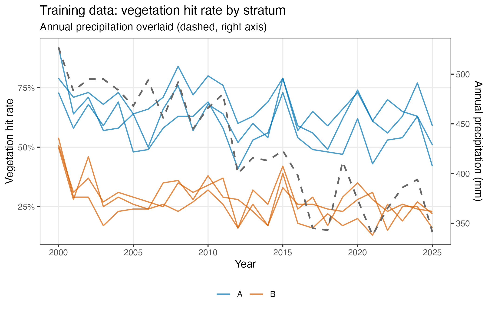
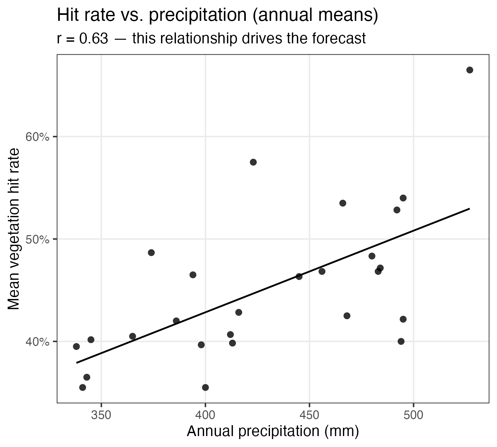
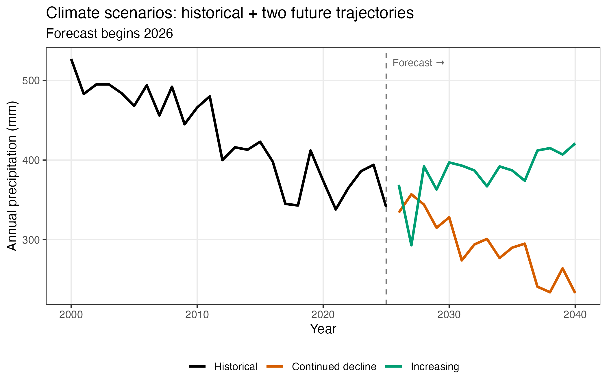

# Your First Forecast (Mock Data)

This tutorial walks through a simple forecast run using synthetic data. By the end you will have fit a model to, used this model to forecast  under two climate scenarios, and explored the forecast's outputs.

## Prerequisites

See [Getting started]() if you haven't already.

## Step 0: Understand the mock data

This mock dataset represents a park unit (ELDO) with two vegetation strata (A and B), three sites per stratum, and one transect per site. The data is annual from 2000 to 2025. Each transect records how many of 100 sample points hit a plant (`y_hits` out of `n_points = 100`). A single climate covariate, precipitation (ppt), declines gradually over the training period and drives the vegetation response.

There are three files, all pre-committed to `assets/_data/`:

| File | What it contains |
|------|-----------------|
| `pg-hits.csv` | Transect-level vegetation observations (one row per transect-year) |
| `pg-covariates.csv` | Annual precipitation per site (one row per site-year) |
| `pg-covariates-scenarios.csv` | Future precipitation under two climate scenarios |


You don't need to generate the data — it's already in the repo. The script that created it is at `forecasting/getting-started/generate-mock-data.R` if you want to play around with generating alternative mock data.


### Trainingg observations (`pg-hits.csv`)

Each row is one transect in one year. The model fits to `y_hits` as a binomial outcome.

| stratum | park_unit | event_year | transect | site | n_points | y_hits |
|---------|-----------|------------|----------|------|----------|--------|
| A | ELDO | 2000 | 1 | A1 | 100 | 94 |
| A | ELDO | 2001 | 1 | A1 | 100 | 62 |
| A | ELDO | 2002 | 1 | A1 | 100 | 72 |
| … | … | … | … | … | … | … |

### Climate covariates (`pg-covariates.csv`)

One precipitation value (mm) per site per year.

| park_unit | stratum | site | event_year | ppt |
|-----------|---------|------|------------|-----|
| ELDO | A | A1 | 2000 | 534 |
| ELDO | A | A1 | 2001 | 480 |
| ELDO | A | A1 | 2002 | 497 |
| … | … | … | … | … |

### Future scenarios (`pg-covariates-scenarios.csv`)

Two climate trajectories (continued decline and increasing), each with one "GCM" model run covering 2026–2040.

| scenario_id | scenario_name | model_run_id | model_run_name | park_unit | stratum | site | event_year | ppt |
|-------------|---------------|--------------|----------------|-----------|---------|------|------------|-----|
| 1 | continued_decline | 1 | Mock-GCM-1 | ELDO | A | A1 | 2026 | 384 |
| 1 | continued_decline | 1 | Mock-GCM-1 | ELDO | A | A1 | 2027 | 330 |
| 1 | continued_decline | 1 | Mock-GCM-1 | ELDO | A | A1 | 2028 | 319 |
| … | … | … | … | … | … | … | … |

### What the data looks like

Vegetation hit rate tracks precipitation closely, with stratum A starting at a higher baseline (~75%) than stratum B (~45%). Both strata decline as precipitation falls.



The precipitation–vegetation relationship is what the model learns and uses to generate forecasts.

<div style="text-align: center;">

</div>

The three future scenarios bracket the range of plausible climate outcomes. Each has three GCM model runs (small offsets representing ensemble spread).



## Step 1: Fit the Model

Now that we understand the data, we can run the fitting pipeline to generate the model artifacts that the forecasting
pipeline will read.

```bash
Rscript analysis-pipeline.R assets/_config/M4MD/ELDO/mock-cover.yml \
  --save-forecast-inputs
```

<!-- TODO: Describe roughly how long this takes and what console output to expect.
     Note that --save-forecast-inputs is the flag that writes the 04-forecast/
     artifacts; without it the forecast pipeline has nothing to read. -->

## Step 2: Inspect the Output (Recommended)

Before forecasting, it is worth browsing the artifacts the fitting step wrote:

```
assets/_output/M4MD/ELDO/mock-cover/<run-id>/04-forecast/forecast-inputs/
```

<!-- TODO: List the key files here (forecasting-metadata.rds, mcmc-draws-full.csv,
     covariate-moments.rds) and give a one-sentence description of each so the
     user understands what the forecast pipeline will read. -->

## Step 3: Run the Forecast

```bash
Rscript forecasting/forecast/forecast-pipeline.R \
  --config forecasting/getting-started/mock-forecast-config.yaml
```

<!-- TODO: Show expected console output (step-by-step log lines). -->

## Reading Your Outputs

<!-- TODO: Point to the reading-your-outputs page once it exists, or fold that
     content here. Outputs land in assets/_output/.../04-forecast/forecasts/.
     Describe the plots and the summary CSV at a high level. -->

---

